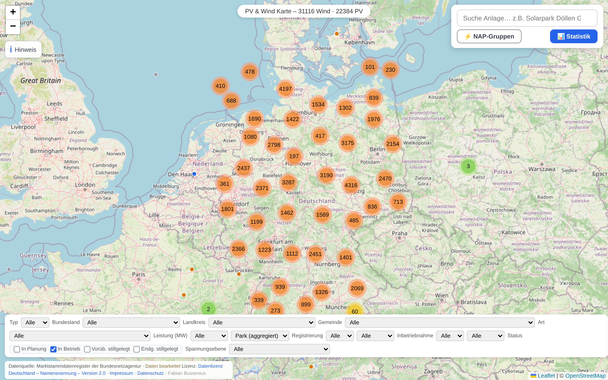
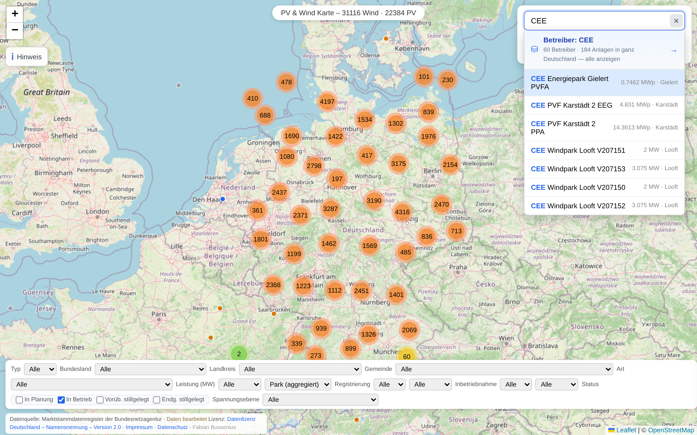
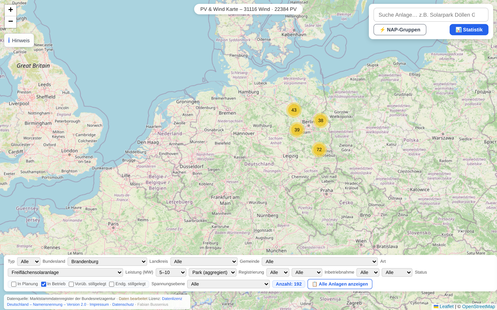
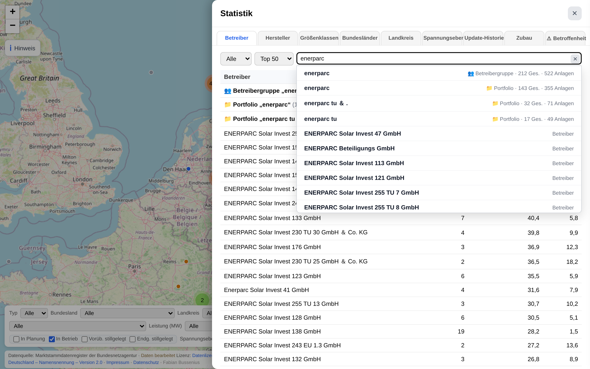
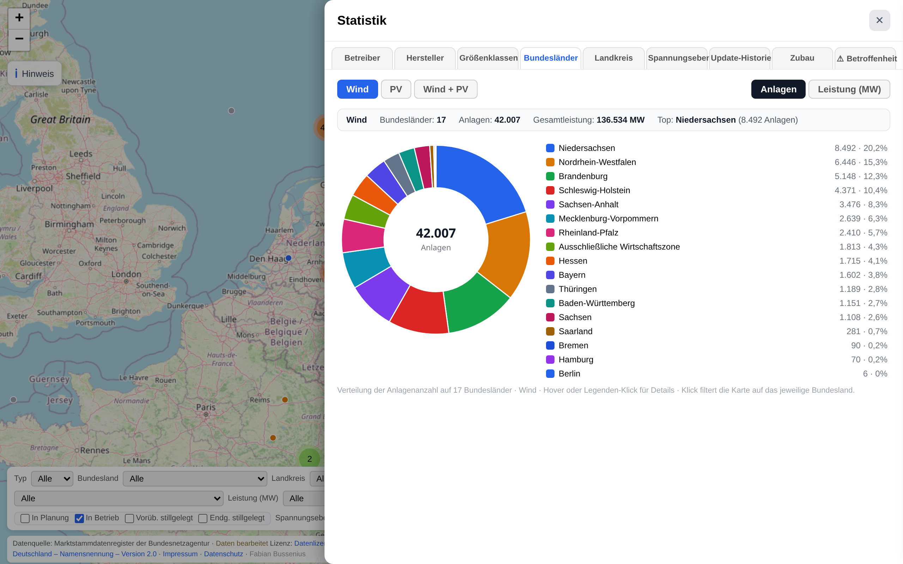
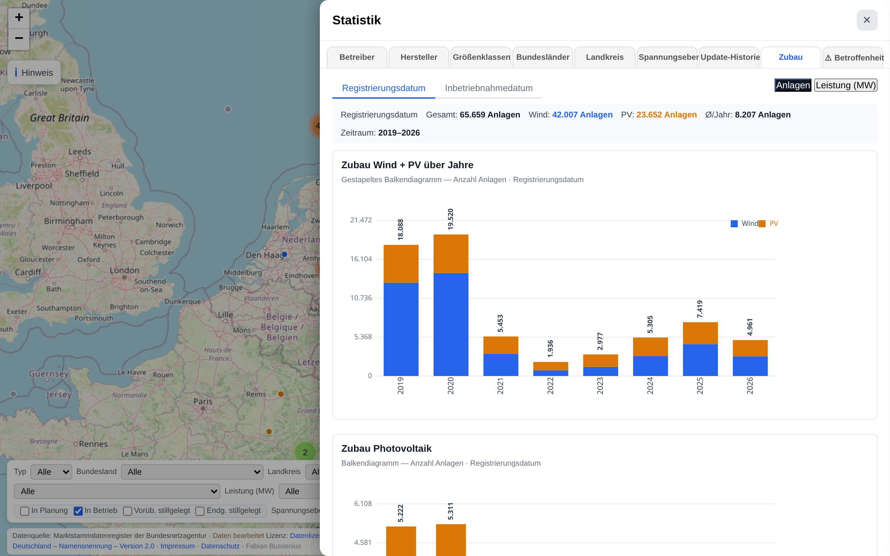
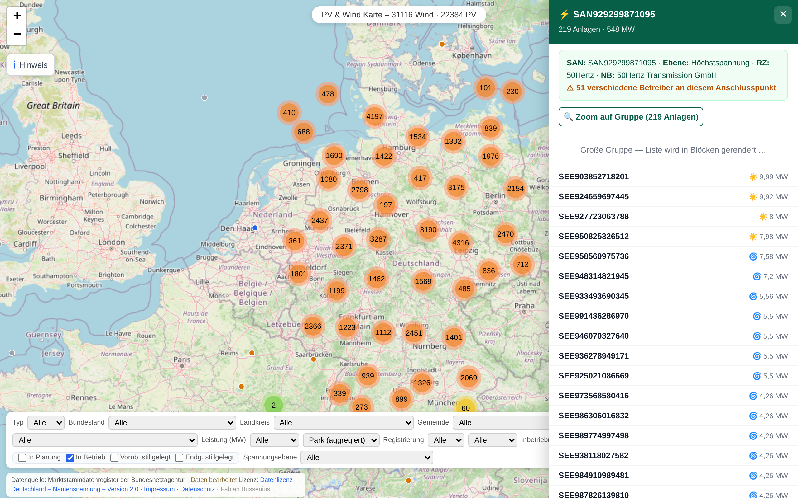
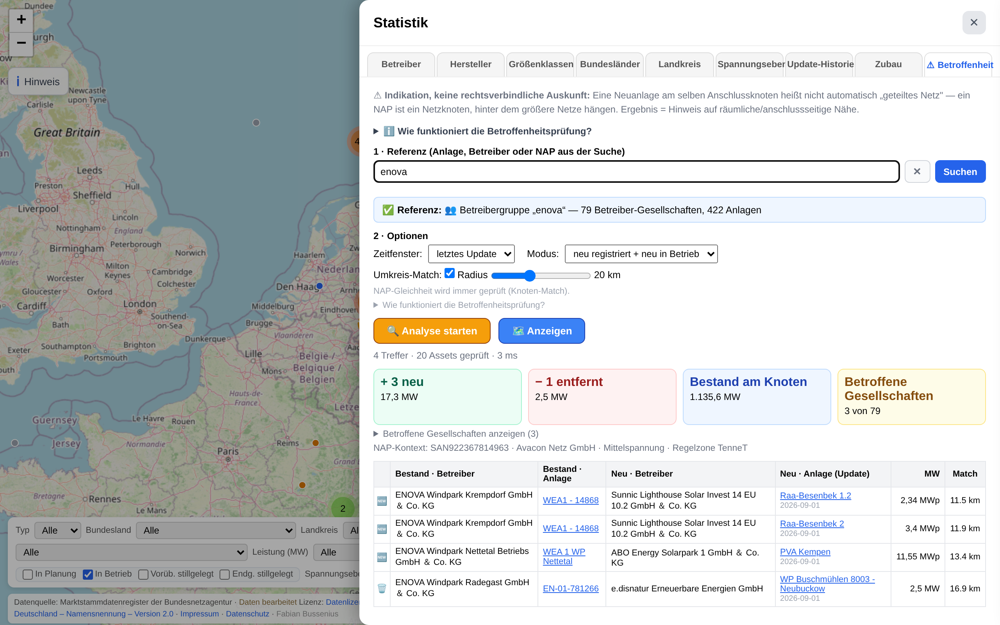
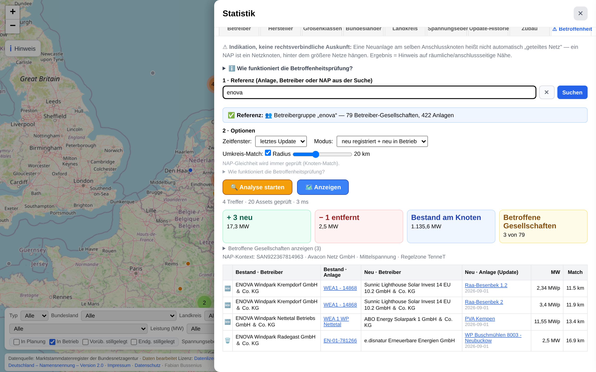

# 65.659 Wind- und PV-Anlagen auf einer Karte — was man aus dem Marktstammdatenregister wirklich herausholen kann

*Von Fabian Bussenius · wind-pv-map.ingenieur-tools.de · ingenieur-tools.de*

---

Das Marktstammdatenregister (MaStR) der Bundesnetzagentur ist die reichhaltigste öffentliche Energie-Datenquelle Deutschlands: Für jede Wind- und Photovoltaikanlage liegen dort Dutzende Felder — Leistung, Standort, Betreiber, Netzanschlusspunkt, Spannungsebene, Inbetriebnahmedatum, uvm. Mehr als 65.000 Einträge allein für Wind und PV (Betrachtung: PV > 500 kW, Wind > 100 kW), jeden Monat kommen neue hinzu.

Das Problem: Das MaStR ist ein Register, keine Karte. Die Daten liegen als strukturierte Einträge vor — nützlich für Nachweispflichten, aber unbrauchbar für die Fragen, die in der Praxis täglich gestellt werden. *Was passiert in meiner Umgebung? Wer hängt an welchem Netzanschlusspunkt? Wo entsteht der nächste Windpark?* Wer das heute beantworten will, lädt CSV-Exporte, bereinigt sie, geokodiert Koordinaten, verknüpft Lokationen mit Netzanschlusspunkten — und baut Infrastruktur nach, die eigentlich fertig sein müsste.

Genau diese Arbeit habe ich in ein Werkzeug gegossen. **wind-pv-map.ingenieur-tools.de** zeigt alle 65.659 Wind- und PV-Anlagen auf einer interaktiven Karte — mit Filtern, Statistiken, Netzanschlusspunkt-Analyse und einem Betroffenheits-Check. Kostenlos, ohne Login, ohne Tracking. Dieser Artikel führt durch die Funktionen und erklärt, wofür sie gut sind.

*Abb. 1: Alle Wind- und PV-Anlagen Deutschlands als Cluster-Karte. Ein Klick auf einen Cluster zoomt hinein, ein Klick auf eine Anlage öffnet das Detail-Popup.*

## Suchen, finden, bündeln

Die Suche kennt Anlagennamen, Betreiber, Portfolien — und jetzt auch **Landkreise und Gemeinden**: Tippt man „Dithmarschen" oder eine Gemeinde wie „Albersdorf" ein, zeigt die Karte direkt alle Anlagen dieser Region. Das ist der entscheidende Punkt: Tippt man einen Betreibernamen ein, bündelt die Karte **alle Anlagen aller zugehörigen Gesellschaften**. Ein Betreiber mit 15 Projektgesellschaften wird nicht zu 15 verstreuten Punkten, sondern zu einem Portfolio auf der Karte.

Jede Anlage öffnet bei Klick ein Detail-Popup mit dem vollständigen MaStR-Profil: MaStR-Nummer, Leistung (bei Wind in MW, bei PV in MWp — das Register unterscheidet nicht sauber nach AC/DC), Standort, Netzbetreiber, Spannungsebene und Inbetriebnahmedatum auf den Tag genau. Der Netzanschlusspunkt ist direkt verlinkt: Ein Klick zeigt alle anderen Anlagen am selben Knoten.

*Abb. 2: Die Suche erkennt Betreiber über alle Einzelgesellschaften hinweg — hier: 60 Betreiber mit 144 Anlagen unter „CEE" auf einen Klick.*

## Filtern wie ein Profi

Für die praktische Arbeit sind Filter das wichtigste Werkzeug. Kombinierbar nach:

- **Typ** (Wind/PV), **Bundesland** (inkl. Offshore-AWZ), **Landkreise/Gemeinden**, **Art** (Freifläche, Gebäude, Balkonkraftwerk, Wind an Land/auf See)
- **Leistung** in festen Größenklassen — mit der BSI-Kritis-Schwelle ab 104 MW als bewusster Grenze
- **Spannungsebene** — aus den Netzanschlusspunkten abgeleitet, nicht geschätzt
- **Registrierungs- und Inbetriebnahmedatum** (Jahr und Monat getrennt)

Jede Filterkombination zeigt sofort ein Badge mit der Anzahl passender Anlagen, die Karte folgt in Echtzeit. Die Tabelle „Alle Anlagen anzeigen" listet das Ergebnis vollständig auf; ein Klick auf einen Anlagennamen fliegt zur Anlage und öffnet ihr Popup, ohne die Filterauswahl zu verlieren.

*Abb. 3: Beispiel-Filterung: 192 Freiflächen-PV-Anlagen zwischen 5 und 10 MW in Brandenburg. Solche Schnitte beantworten Fragestellungen wie „Wo und in welcher Größenordnung entsteht Freiflächen-PV?"*

## Statistik, die mitdenkt

Der Statistik-Bereich reicht über einfache Balken hinaus. Der **Betreiber-Tab** erkennt automatisch zusammengehörige Gesellschaften als Betreibergruppen und Portfolios — sucht man „enerparc", erscheint nicht eine zufällige Einzelgesellschaft, sondern die Gruppe mit 212 Gesellschaften und 522 Anlagen (3.217 MW). Ein Klick zeigt alle zugehörigen Anlagen auf der Karte. Die Tabelle ist sortier- und durchsuchbar. Ein eigener **Landkreis-Tab** aggregiert Assets und Netzanschlusspunkte je Kreis — inklusive Klick direkt auf die Karte.

*Abb. 4: Der Betreiber-Tab gruppiert automatisch: Betreibergruppe „enerparc" mit 212 Gesellschaften, 522 Anlagen, 3.217 MW — darunter Portfolios und Einzelgesellschaften, sortierbar nach jeder Spalte.*

Der **Bundesländer-Tab** zerlegt den Bestand interaktiv nach Region, Energieträger und Metrik (Anzahl oder Leistung). Für Marktanalysen und Regionalvergleiche entfällt die gesamte Vorarbeit des Daten-Zusammensuchens.

*Abb. 5: 42.007 Windanlagen verteilt auf 17 Bundesländer — Niedersachsen führt mit 20,2 %, dicht gefolgt von NRW und Brandenburg. Klick auf ein Segment filtert die Karte.*

## Zubau: Wo wächst der Markt wirklich?

Der Zubau-Tab beantwortet die Frage, die hinter Bestandszahlen versteckt bleibt: *Wie schnell wächst was — relativ zu was?* Am aufschlussreichsten ist das Liniendiagramm „Wachstum gegenüber kumuliertem Bestand": Es zeigt den Jahreszubau als Prozentsatz des bis dahin vorhandenen Bestands — getrennt nach Wind und PV, jeweils nach Registrierungs- und Inbetriebnahmedatum.

Warum das wichtig ist: Absolute Zubauzahlen suggerieren Linearität. Relativ zum Bestand gemessen sieht man Phasen der Beschleunigung und Sättigung — und dass Wind und PV sich auf sehr unterschiedlichem Niveau stabilisiert haben. Für Portfolio-Entscheidungen (welcher Markt reift, wo ist noch Spielraum) ist diese Sicht die relevantere.

*Abb. 6: Jahreszubau als % des kumulierten Bestands. Die Kurven zeigen, in welchen Jahren der Markt relativ zu seiner Größe am schnellsten gewachsen ist — und wie sich Wind und PV dabei unterscheiden.*

## Netzanschlusspunkte: Das Scharnier zwischen Anlage und Netz

Für jeden Betreiber einer Bestandsanlage ist der Netzanschlusspunkt (NAP) die kritische Infrastruktur: Hier entscheidet sich, was am selben Knoten noch Anschluss findet. Die Karte bietet einen eigenen NAP-Modus: Sie zeigt pro Anschlusspunkt, wie viele Anlagen dort hängen — ein Klick öffnet die komplette Liste mit Spannungsebene, Regelzone und Netzbetreiber.

Das Beispiel ist kein Extremfall, sondern die größte Gruppe: **219 Anlagen mit zusammen 548 MW an einem einzigen Höchstspannungs-Anschlusspunkt** (50Hertz-Regelzone) — betrieben von **51 verschiedenen Gesellschaften**. Sichtbar wird, was im klassischen Register unsichtbar bleibt: dass sich an einzelnen Knoten Dutzend Betreiber die gleiche Infrastruktur teilen. Diese Transparenz ist Voraussetzung, wenn man Kabeltrassen-Planung, Netzreserven oder Nachbarschaftsverhältnisse realistisch bewerten will.

*Abb. 7: Die NAP-Gruppenansicht bündelt alle Anlagen pro Netzanschlusspunkt. Dieses Beispiel: 219 Anlagen, 548 MW, 51 Betreiber an einem Höchstspannungspunkt in der Uckermark.*

## Der Betroffenheits-Check — für Legal, Technik und Projektentwicklung

Das Herzstück für die Praxis ist der Betroffenheits-Tab. Die Fragestellung: *Was kommt auf meine Bestandsanlagen zu?*

Die Logik: Man wählt eine Referenz — eine eigene Anlage, einen eigenen Betreiber (inkl. automatisch erkannter Gruppen und Portfolios) oder einen NAP. Die Analyse prüft dann gegen die Update-Historie des MaStR, welche Anlagen **neu registriert oder neu in Betrieb gesetzt** wurden, die entweder

- am **selben Netzanschlusspunkt** hängen, oder
- im wählbaren **Umkreis** (2–50 km) der Bestandsanlagen liegen.

*Abb. 8: Analyse für die Betreibergruppe „enova" (79 Gesellschaften, 422 Anlagen): 4 Treffer im 20-km-Umkreis — 3 Neuanlagen (+17,3 MW), 1 entfernte Anlage (−2,5 MW), Bestand am Knoten 1.135,6 MW.*

Das Ergebnis ist eine Vergleichstabelle: Bestandsanlage ↔ Neuanlage, mit Betreibern, Leistungen, Match-Kriterium und Distanz. Jeder Treffer ist klickbar und öffnet die Anlage auf der Karte.

*Abb. 9: Die Treffer im Detail — z. B. eine neue PV-Freifläche 11,5 km von einer Bestands-Windturbine entfernt. Jede Zeile ist klickbar und führt zur Karte.*

**Warum das relevant ist — je nach Perspektive:**

- **Legal:** Neue Nachbarprojekte können Rechte und Pflichten berühren — Immissionsprognosen (Schall, Schattenwurf), Nachbarschutz, die Verhandlungsposition bei Pachtverlängerungen oder B-Plan-Verfahren. Wer früh weiß, welche Projekte sich in der Umgebung registrieren, kann rechtzeitig bewerten und reagieren, statt hinterherzulaufen.
- **Technik/Netz:** Neue Anlagen am selben Knoten oder in der Nähe verändern die Netzsituation. Die Kombination aus NAP-Gleichheit und Umkreis-Match ist der schnellste Weg, Netzengpässe und Ansiedlungsdichte zu antizipieren — gerade dort, wo Kabeltrassen und Umspannkapazitäten begrenzt sind.
- **Projektentwicklung:** Wer Flächen sucht oder Bestände bewertet, braucht ein realistisches Bild davon, was in der Umgebung tatsächlich passiert — nicht nur, was bereits genehmigt ist. Der Betroffenheits-Check zeigt früh, wo sich Konkurrenzprojekte registrieren, welche Knoten bereits hohe Anschlussdichte haben und wo sich in der Nachbarschaft von Bestandsanlagen etwas tut. Daraus lassen sich Anschlusspotenziale, Gebietsfokus und Verhandlungsposition (z. B. bei Pachtverlängerungen gegenüber Landwirten) deutlich fundierter einschätzen — als Frühindikator, bevor Projekte in Verfahren und Ausschreibungen sichtbar werden.

**Einordnung — und das ist wichtig:**

- Der Betroffenheits-Check ist ein **Frühindikator**, kein Ersatz für due diligence. Er ersetzt insbesondere **nicht das BIL-Portal**: Keine amtlichen Auszüge aus dem B-Plan, keine verbindlichen Genehmigungsstände, keine Rechtsbehelfsfristen. Was er leistet: Er zeigt, *was sich im MaStR tut*, **bevor** formalisierte Anfragen und Verfahren beim BIL-Portal einlaufen — so kann sich ein Betreiber früh auf künftige Anfragen einstellen und bleibt laufend up to date, ohne jedes Register-Update selbst zu verfolgen.
- Die **einzige Datenquelle ist das Marktstammdatenregister**. Keine behördlichen Veröffentlichungen zu Genehmigungsverfahren, keine B-Plan-Informationen, keine Naturschutz- oder Artenschutzdaten. Was nicht im MaStR steht, erscheint nicht — und was dort verspätet eingetragen wird, erscheint verspätet.
- Das Werkzeug liefert eine **Indikation, keine rechtsverbindliche Auskunft** — dieser Hinweis steht auch direkt in der Anwendung.

## Unter der Haube — kurz

Für die technisch Interessierten:

- **Anlagen:** Um insbesondere die winzigen, aber sehr zahlreichen, PV-Dachanlagen aus der Betrachtung zu nehmen und den Datensatz nicht immens aufzublähen, gilt die Darstellungsschwelle von: Wind ≥100 kW & PV ≥0,5 MWp
- **Vollständigkeit:** Alle 118 Felder pro Einheit werden verarbeitet, inkl. Netzanschlusspunkte: Vollabgleich über 30.929 Lokationen mit 27.870 NAPs (97,8 % aller NAPs sind von Anlagen belegt)
- **Aktualität:** Eine Pipeline aktualisiert Wind-, PV- und NAP-Daten inkrementell, zukünftig alle 14 Tage; die Karte zeigt den Datenstand transparent an
- **Transparenz:** Der Update-Historie-Tab dokumentiert jede Datenrevision mit Delta-Zusammenfassung — was ist neu, was ist entfernt, was hat sich geändert
- **Datenschutz:** Kein Tracking, keine externen CDNs, Kartenkacheln lokal eingebettet — DSGVO-konform by design, ohne Cookie-Banner-Tricks

## Selbst ausprobieren

Die Karte läuft unter **wind-pv-map.ingenieur-tools.de** — ohne Registrierung, direkt im Browser. Feedback, Verbesserungsideen, gefundene Fehler: Ich freue mich über Kommentare und Nachrichten.

*Fabian Bussenius — Ingenieur an der Schnittstelle von Energiedaten und Praxis. Weitere Tools: ingenieur-tools.de.*

**Datenquelle:** Marktstammdatenregister der Bundesnetzagentur, Datenlizenz Deutschland – Namensnennung – 2.0. Datenstand: September 2026.
